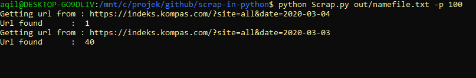
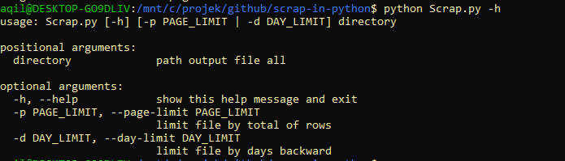

# Scrap in Python

## Run Program
- Example : `python Scrap.py out/namefile.txt -p 100`

- More info : `python Scrap.py -h`

## Requirement
- python3 (recommended)
- `pip install -r requirements.txt`

## Sources
- [beatifulsoup4](https://www.crummy.com/software/BeautifulSoup/bs4/doc/)